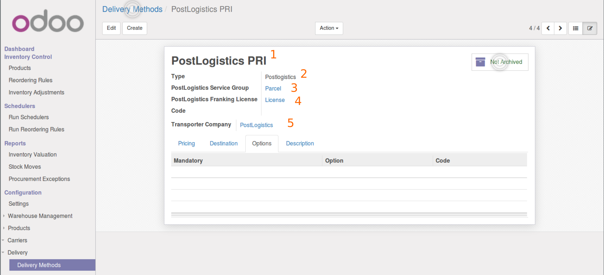
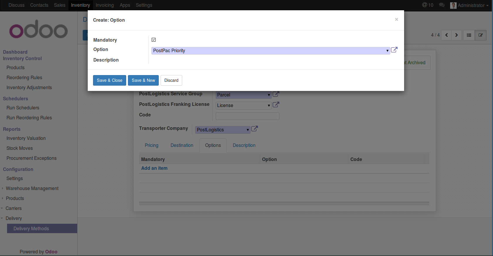
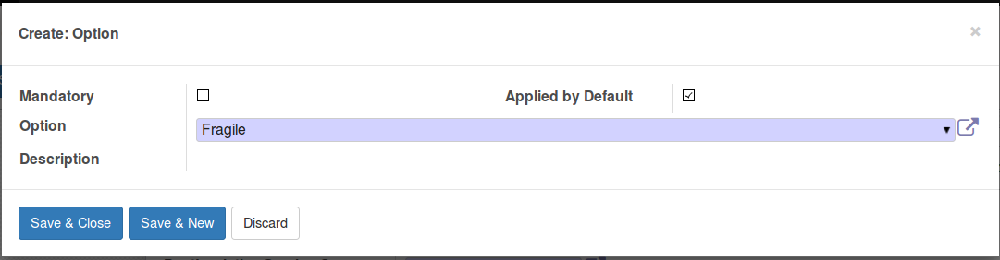
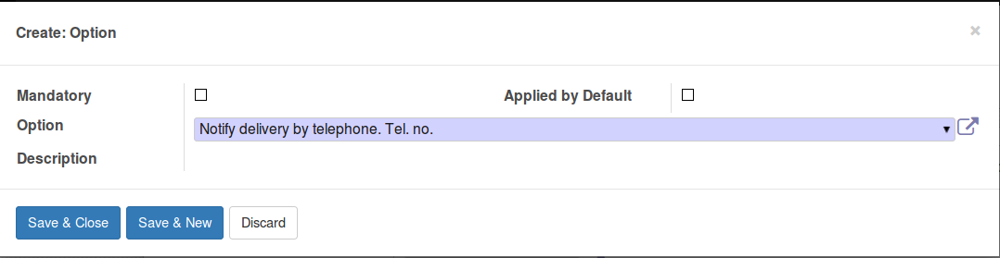

.. _delivery_method_setup:

###########################
Setting up delivery methods
###########################

Before we can generate our first labels we needs to setup one or multiple delivery methods
of PostLogistics type.

The number of option which are available is quite huge. Please refer to `"Barcode" web service manual`_

**********************
Create delivery method
**********************

Go in *Inventory/Settings/Delivery/Delivery Methods* and create a new delivery methods

1. Give a name to your delivery method
2. Choose type *PostLogistics*
3. Choose a *Service Group*. Refer to `"Barcode" web service manual`_ to know which services are included in each group.
   You most likely want to select "Parcel" service group here.
4. Optionaly select a license. If you have done the step to with the button *Assign PostLogistics to service groups* it will try detect which license to use.
5. Choose *Transporter company* selecting *PostLogistics*

Save (This is an important step as it will refresh the available options)

*************
Basic service
*************

Add a basic service by adding on option.

1. Check option as mandatory mandatory.
2. Choose a basic serive
   Important: only the basic options of the selected service group will be available.
   If your option is not there, for exemple you are looking for *Bulky goods "Lightning"* this one is in *Swiss-Express / Swiss-Courier* service group.
3. Save and close

Save again the delivery method (We need to refresh the list as now we will have delivery instruction allowed with the basic service)

*******************************************
Optional services and delivery instructions
*******************************************

Now you can as many other option and delivery instructions you need.

It is important to understand that those options will be copied on the delivery order when setting the delivery method on the delivery order.
Thus here we are defining options for the label with a configurable liberty for the logistician to do few changes.
And then when generating the shipping label, options on the delivery order will be used.
This can be useful to manage extraordinary case manualy on the delivery order.
e. g. You can add a delivery instruction as optional for rare case when the customer asks to be called when the package arrives.

There are 3 types of options:

* *Mandatory*: Each Delivery order with this delivery method will have this option. It is a good practice to set the basic service (e.g. ECO) as mandatory as you want always a basic service when generating labels.
* *Applied by default*: This option will be added on the delivery order. This one can be removed by the logistician.
* *Optional*: This one won't be added on the delivery order. It becomes an allowed option, settable on the delivery order.

Here is an exemple of *Applied by default* option.

And here an optional option, we simply leave empty the two check boxes.

*************
Output format
*************

You can also add options to override output format. Otherwise the resulting label will be generated using default values setted in PostLogistics settings.

.. _`"Barcode" web service manual`: https://www.post.ch/-/media/post/gk/dokumente/barcode-handbuch.pdf?la=en&vs=2
